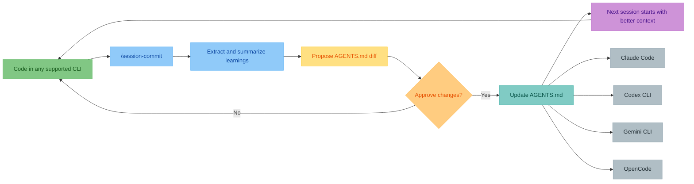
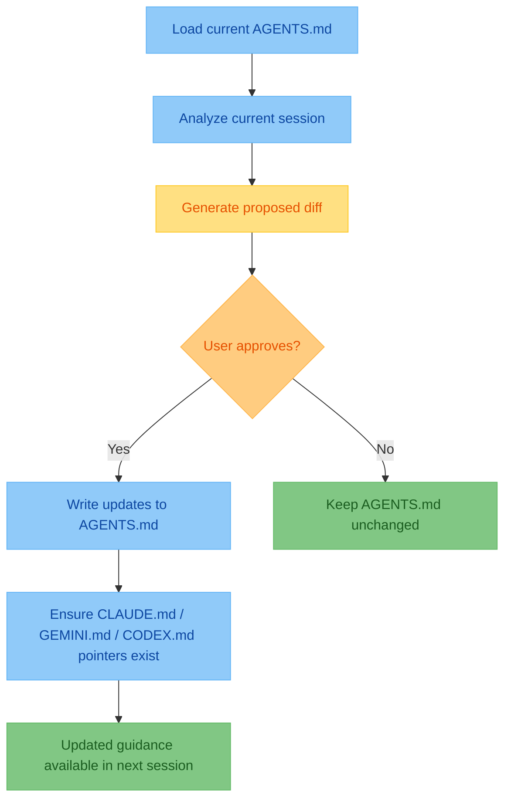

> [!TIP]
> Close the loop after every coding session with one command.
> Keep `AGENTS.md` updated so every agent and teammate starts with current project context.

# agent-md <!-- omit in toc -->

[](#codex-cli)
[](#claude-code)
[](#gemini-cli)
[](#opencode)
[](https://opensource.org/licenses/MIT)

<!-- TODO: Add a 30-second demo GIF/video here (install -> run /session-commit -> AGENTS.md diff). -->
<!-- TODO: Replace this social proof with verified stars/downloads or a real quote. -->

> [!NOTE]
> **Early traction:** Teams using multi-agent workflows report less repeated
> prompting and faster onboarding after adopting `session-commit`.
>
> "We made this part of our end-of-session routine and handoffs got cleaner." - Maya L., OSS maintainer

- Capture session learnings into `AGENTS.md` after each coding session
- Share patterns across Claude Code, Codex CLI, Gemini CLI, and OpenCode
- Reduce repeated prompting and improve agent + human onboarding

- [Quickstart](#quickstart)
  - [Codex CLI](#codex-cli)
  - [Claude Code](#claude-code)
  - [Gemini CLI](#gemini-cli)
  - [OpenCode](#opencode)
- [At A Glance](#at-a-glance)
- [Who Is This For](#who-is-this-for)
- [What This Gives You](#what-this-gives-you)
- [How It Works](#how-it-works)
- [Cross-Tool Compatibility](#cross-tool-compatibility)
- [What Gets Captured](#what-gets-captured)
- [Star History](#star-history)

## Quickstart

- Choose your tool
- Install once
- Run `/session-commit` (or `/agent-md:session-commit` in Claude Code)

| Tool        | Install                                                                                                                                                                         | Run                        |
| ----------- | ------------------------------------------------------------------------------------------------------------------------------------------------------------------------------- | -------------------------- |
| Codex CLI   | `mkdir -p ~/.codex/prompts && curl -sO --output-dir ~/.codex/prompts https://raw.githubusercontent.com/olshansk/agent-md/main/commands/session-commit.md`                       | `/prompts:session-commit`  |
| Claude Code | `/plugin marketplace add olshansk/agent-md` then `/plugin install agent-md@olshansk`                                                                                            | `/agent-md:session-commit` |
| Gemini CLI  | `gemini extensions install https://github.com/olshansk/agent-md`                                                                                                                | `/session-commit`          |
| OpenCode    | `mkdir -p ~/.config/opencode/commands && curl -sO --output-dir ~/.config/opencode/commands https://raw.githubusercontent.com/olshansk/agent-md/main/commands/session-commit.md` | `/session-commit`          |

<details>
<summary><h3 id="codex-cli">Codex CLI</h3></summary>

**Codex reads `AGENTS.md` natively**: https://developers.openai.com/codex/guides/agents-md

Install:

```bash
mkdir -p ~/.codex/prompts
curl -sO --output-dir ~/.codex/prompts https://raw.githubusercontent.com/olshansk/agent-md/main/commands/session-commit.md
```

Run:

```bash
/prompts:session-commit
```

Update:

```bash
curl -sO --output-dir ~/.codex/prompts https://raw.githubusercontent.com/olshansk/agent-md/main/commands/session-commit.md
```

Remove:

```bash
rm ~/.codex/prompts/session-commit.md
```

</details>

<details>
<summary><h3 id="claude-code">Claude Code</h3></summary>

Add marketplace:

```bash
/plugin marketplace add olshansk/agent-md
```

Install plugin:

```bash
/plugin install agent-md@olshansk
```

_Restart Claude Code after installation._

Run:

```bash
/agent-md:session-commit
```

Update:

```bash
/plugin update agent-md@olshansk
```

Remove:

```bash
/plugin uninstall agent-md
/plugin marketplace remove olshansk
```

</details>

<details>
<summary><h3 id="gemini-cli">Gemini CLI</h3></summary>

Install:

```bash
gemini extensions install https://github.com/olshansk/agent-md
```

_Restart Gemini CLI after installation._

Run:

```bash
/session-commit
```

Update:

```bash
gemini extensions install https://github.com/olshansk/agent-md
```

Remove:

```bash
gemini extensions uninstall agent-md
```

</details>

<details>
<summary><h3 id="opencode">OpenCode</h3></summary>

**OpenCode reads `AGENTS.md` natively**: https://opencode.ai/docs/rules/

Install:

```bash
mkdir -p ~/.config/opencode/commands
curl -sO --output-dir ~/.config/opencode/commands https://raw.githubusercontent.com/olshansk/agent-md/main/commands/session-commit.md
```

Run:

```bash
/session-commit
```

Update:

```bash
curl -sO --output-dir ~/.config/opencode/commands https://raw.githubusercontent.com/olshansk/agent-md/main/commands/session-commit.md
```

Remove:

```bash
rm ~/.config/opencode/commands/session-commit.md
```

</details>

## At A Glance



<!-- TODO: Add a real before/after AGENTS.md example from one session with a concise diff. -->

## Who Is This For

- Solo developers who use AI coding tools and want less repeated prompting
- AI-heavy teams that need shared project memory across tools and sessions
- Open-source maintainers who want contributors and agents to ramp faster

## What This Gives You

- A living `AGENTS.md` that captures real project decisions over time
- Better consistency across agents, sessions, and teammates
- Faster onboarding for new contributors and new coding agents
- A lightweight routine that compounds after every session

## How It Works

- Run the session command at the end of a coding session
- Review the proposed diff to `AGENTS.md`
- Confirm or reject changes
- Keep learnings available to every tool that reads your repo



## Cross-Tool Compatibility

| Tool        | Reads                | Pointer file needed? |
| ----------- | -------------------- | -------------------- |
| Claude Code | `CLAUDE.md`          | Yes                  |
| OpenCode    | `AGENTS.md` (native) | No                   |
| Codex CLI   | `AGENTS.md` (native) | No                   |
| Gemini CLI  | `GEMINI.md`          | Yes                  |

- OpenCode also falls back to `CLAUDE.md` for Claude Code compatibility
- Codex can optionally use `CODEX.md` via `project_doc_fallback_filenames`

## What Gets Captured

| Category     | Examples                                |
| ------------ | --------------------------------------- |
| Patterns     | Code style and naming conventions       |
| Architecture | Why things are structured a certain way |
| Gotchas      | Pitfalls discovered during development  |
| Debugging    | What to check when things break         |

## Star History

[](https://www.star-history.com/#olshansk/agent-md&type=date&legend=top-left)
