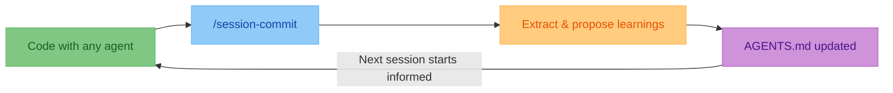

> [!TIP]
> Close the loop after every coding session with one skill.
> Keep `AGENTS.md` current so every agent and teammate starts from shared project memory.

# agent-skills <!-- omit in toc -->

[](#manual-install-fallback)
[](#manual-install-fallback)
[](#manual-install-fallback)
[](#manual-install-fallback)
[](https://opensource.org/licenses/MIT)

<!-- TODO: Add a 30-second demo GIF/video here (install -> run a skill -> show output). -->

> [!NOTE]
> **Early traction:** Teams using multi-agent workflows report less repeated
> prompting and faster onboarding after adopting these skills.
>
> "We made this part of our end-of-session routine and handoffs got cleaner." - Maya L., OSS maintainer

- Multi-skill catalog for agentic CLIs
- Primary distribution: `npx skills add olshansk/agent-skills`
- Also published for Agent Skills ecosystem discovery: https://agentskills.io/home

## Table of Contents <!-- omit in toc -->

- [Quickstart](#quickstart)
- [Available Skills](#available-skills)
- [Manual Install Fallback](#manual-install-fallback)
  - [Codex CLI](#codex-cli)
  - [Claude Code](#claude-code)
  - [Gemini CLI](#gemini-cli)
  - [OpenCode](#opencode)
- [At A Glance](#at-a-glance)
- [Validation](#validation)
- [Star History](#star-history)

## Quickstart

Install the catalog:

```bash
npx skills add olshansk/agent-skills
```

Then ask your agent to run any installed skill (e.g., "close the loop", "generate skills dashboard").

## Available Skills

| Skill              | What it does                                                    | Trigger examples                                               |
| ------------------ | --------------------------------------------------------------- | -------------------------------------------------------------- |
| `session-commit`   | Captures session learnings and updates `AGENTS.md` safely       | "run session commit", "close the loop", "update AGENTS.md"     |
| `skills-dashboard` | Scrapes skills.sh and generates an interactive HTML dashboard   | "generate skills dashboard", "show skills ecosystem"           |

## Manual Install Fallback

Use this if you are not using `npx skills add` yet.

| Tool        | Install                                                                                                                                                                             | Run command                    |
| ----------- | ----------------------------------------------------------------------------------------------------------------------------------------------------------------------------------- | ------------------------------ |
| Codex CLI   | `mkdir -p ~/.codex/prompts && curl -sO --output-dir ~/.codex/prompts https://raw.githubusercontent.com/olshansk/agent-skills/main/skills/session-commit/commands/session-commit.md`                   | `/prompts:session-commit`      |
| Claude Code | `/plugin marketplace add olshansk/agent-skills` then `/plugin install agent-skills@olshansk`                                                                                      | `/agent-skills:session-commit` |
| Gemini CLI  | `gemini extensions install https://github.com/olshansk/agent-skills`                                                                                                               | `/session-commit`              |
| OpenCode    | `mkdir -p ~/.config/opencode/commands && curl -sO --output-dir ~/.config/opencode/commands https://raw.githubusercontent.com/olshansk/agent-skills/main/skills/session-commit/commands/session-commit.md` | `/session-commit`              |

<details>
<summary><h3 id="codex-cli">Codex CLI</h3></summary>

Install:

```bash
mkdir -p ~/.codex/prompts
curl -sO --output-dir ~/.codex/prompts https://raw.githubusercontent.com/olshansk/agent-skills/main/skills/session-commit/commands/session-commit.md
```

Run:

```bash
/prompts:session-commit
```

Update:

```bash
curl -sO --output-dir ~/.codex/prompts https://raw.githubusercontent.com/olshansk/agent-skills/main/skills/session-commit/commands/session-commit.md
```

Remove:

```bash
rm ~/.codex/prompts/session-commit.md
```

</details>

<details>
<summary><h3 id="claude-code">Claude Code</h3></summary>

Add marketplace:

```bash
/plugin marketplace add olshansk/agent-skills
```

Install plugin:

```bash
/plugin install agent-skills@olshansk
```

Run:

```bash
/agent-skills:session-commit
```

Update:

```bash
/plugin update agent-skills@olshansk
```

Remove:

```bash
/plugin uninstall agent-skills
/plugin marketplace remove olshansk
```

</details>

<details>
<summary><h3 id="gemini-cli">Gemini CLI</h3></summary>

Install:

```bash
gemini extensions install https://github.com/olshansk/agent-skills
```

Run:

```bash
/session-commit
```

Update:

```bash
gemini extensions install https://github.com/olshansk/agent-skills
```

Remove:

```bash
gemini extensions uninstall agent-skills
```

</details>

<details>
<summary><h3 id="opencode">OpenCode</h3></summary>

Install:

```bash
mkdir -p ~/.config/opencode/commands
curl -sO --output-dir ~/.config/opencode/commands https://raw.githubusercontent.com/olshansk/agent-skills/main/skills/session-commit/commands/session-commit.md
```

Run:

```bash
/session-commit
```

Update:

```bash
curl -sO --output-dir ~/.config/opencode/commands https://raw.githubusercontent.com/olshansk/agent-skills/main/skills/session-commit/commands/session-commit.md
```

Remove:

```bash
rm ~/.config/opencode/commands/session-commit.md
```

</details>

## At A Glance



## Validation

CI runs skill validation on changes under `skills/**`.

## Star History

[](https://www.star-history.com/#olshansk/agent-skills&type=date&legend=top-left)
