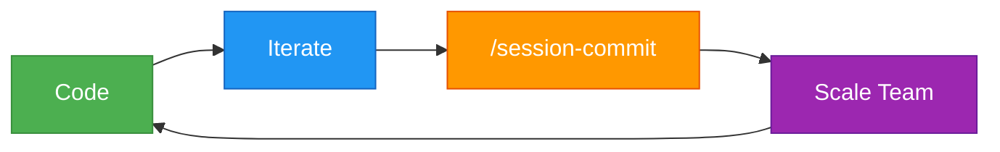
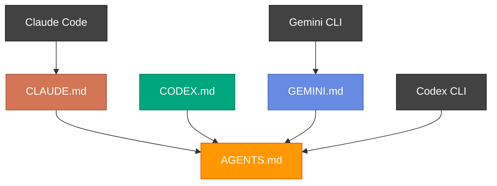
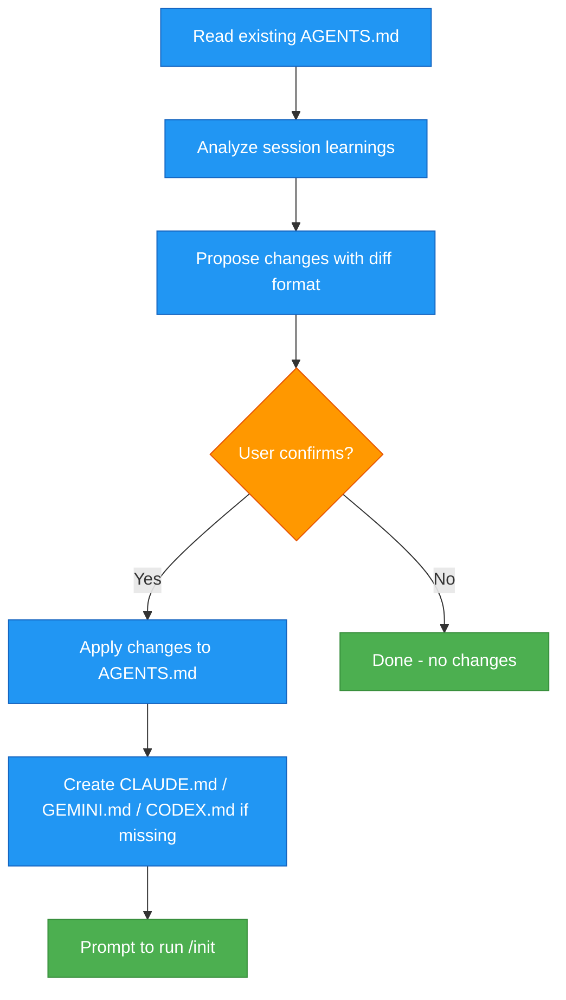

> [!TIP]
> This is the easiest way to keep your `AGENTS.md` in sync with your codebase's best practices and patterns.

# agent-md <!-- omit in toc -->

[](#claude-code)
[](#codex-cli)
[](#gemini-cli)
[](https://opensource.org/licenses/MIT)

**Scale your team, be it agents or humans, by keeping track of your team's development patterns.**

`AGENTS.md` is the new source of truth for your repo's structure, best practices, decisions and taste.

Don't let a good agnetic session go to waste. Commit it.



- [Quickstart](#quickstart)
  - [Claude Code](#claude-code)
  - [Codex CLI](#codex-cli)
  - [Gemini CLI](#gemini-cli)
- [How It Works](#how-it-works)
- [Cross-Tool Compatibility](#cross-tool-compatibility)
- [Why This Exists](#why-this-exists)
- [What Does This Plugin Do?](#what-does-this-plugin-do)
- [What Gets Captured](#what-gets-captured)
- [Star History](#star-history)

## Quickstart

### Claude Code

Add the marketplace:

```bash
/plugin marketplace add olshansk/agent-md
```

Install the plugin:

```
/plugin install agent-md@olshansk
```

> [!NOTE]
> After installing, restart Claude Code for the plugin to take effect.

Use the plugin:

```bash
/session-commit
```

Update the plugin:

```bash
/plugin update agent-md@olshansk
```

> [!TIP]
> Configure the plugin to auto update.
> Run `/plugin` → Select Marketplaces → Choose olshansk → Enable auto-update

<details>
<summary> (If you're not satisfied) Removing the plugin </summary>

Uninstall the plugin:

```bash
/plugin uninstall agent-md
```

Remove the marketplace (optional)

```bash
/plugin marketplace remove olshansk
```

</details>

---

### Codex CLI

Codex [reads `AGENTS.md` natively](https://developers.openai.com/codex/guides/agents-md) — no plugin installation needed. Any learnings captured by this plugin are automatically available to Codex.

**To run the session-commit workflow in Codex**, paste this prompt at the end of a session:

```
Review this session for best practices, patterns, gotchas, and architecture decisions.
Update AGENTS.md with the learnings. If AGENTS.md doesn't exist, create it.
Also ensure CODEX.md exists and points to AGENTS.md as the source of truth.
Show me the proposed changes in diff format before applying.
```

**Optional — Add `CODEX.md` as a fallback filename** in `~/.codex/config.toml`:

```toml
project_doc_fallback_filenames = ["CODEX.md"]
```

This tells Codex to also read `CODEX.md` when discovering project instructions.

---

### Gemini CLI

Gemini CLI reads `GEMINI.md` for project context. This plugin creates a `GEMINI.md` that points to `AGENTS.md`, so Gemini picks up the same learnings.

**To run the session-commit workflow in Gemini**, paste this prompt at the end of a session:

```
Review this session for best practices, patterns, gotchas, and architecture decisions.
Update AGENTS.md with the learnings. If AGENTS.md doesn't exist, create it.
Also ensure GEMINI.md exists and points to AGENTS.md as the source of truth.
Show me the proposed changes in diff format before applying.
```

**Optional — Create a reusable custom command** at `~/.gemini/commands/session-commit.toml`:

```toml
[command]
name = "session-commit"
description = "Capture session learnings to AGENTS.md"

[prompt]
text = """
Review this session for best practices, patterns, gotchas, and architecture decisions.
Update AGENTS.md with the learnings. If AGENTS.md doesn't exist, create it.
Also ensure GEMINI.md exists and points to AGENTS.md as the source of truth.
Show me the proposed changes in diff format before applying.
"""
```

Then run it with:

```bash
/session-commit
```

## How It Works

This plugin maintains `AGENTS.md` as the single source of truth for project knowledge. Each AI coding tool reads its own instruction file, and they all point back to `AGENTS.md`:

| Tool        | Reads                | Points to   |
| ----------- | -------------------- | ----------- |
| Claude Code | `CLAUDE.md`          | `AGENTS.md` |
| Codex CLI   | `AGENTS.md` (native) | —           |
| Gemini CLI  | `GEMINI.md`          | `AGENTS.md` |

Run `/session-commit` (or the equivalent prompt) at the end of a coding session. The plugin captures learnings and writes them to `AGENTS.md`, making them available to every tool and every team member.

## Cross-Tool Compatibility

The key insight: `AGENTS.md` is tool-agnostic. A session captured in Claude Code benefits Codex, Gemini, and any human reading the repo.



The plugin ensures these files exist in your project:

- `AGENTS.md` — the source of truth (all learnings go here)
- `CLAUDE.md` — minimal pointer for Claude Code
- `CODEX.md` — minimal pointer for Codex CLI (optional, since Codex reads `AGENTS.md` directly)
- `GEMINI.md` — minimal pointer for Gemini CLI

## Why This Exists

Every one of your coding sessions likely results in some best practice, pattern, or other tidbit of knowledge worth remembering for future sessions.

The only way to scale a team of human software engineers or fleet of agents is to disseminate best practices.

Best of all, we have `AGENTS.md` for this now!

## What Does This Plugin Do?



## What Gets Captured

| Category     | Examples                                |
| ------------ | --------------------------------------- |
| Patterns     | Code style, naming conventions          |
| Architecture | Why things are structured a certain way |
| Gotchas      | Pitfalls discovered during development  |
| Debugging    | What to check when things break         |

## Star History

[](https://www.star-history.com/#olshansk/agent-md&type=date&legend=top-left)
