> [!TIP]
> This is the easiest way to keep your `AGENTS.md` in sync with your codebase's best practices and patterns.
> 
> **`agent-md/session-commit`: Update your AGENTS.md after each session**

# agent-md <!-- omit in toc -->

[](#codex-cli)
[](#claude-code)
[](#gemini-cli)
[](#opencode)
[](https://opensource.org/licenses/MIT)

**Scale your team, be it agents 🤖 or humans 👩‍💻, by keeping track of your team's development patterns 📚**

`AGENTS.md` is the new source of truth for your repo's structure, best practices, decisions and taste.

Don't let a good agnetic session go to waste. Commit it.

```mermaid
graph LR
    A[Code]:::code --> B[Iterate]:::iterate
    B --> C["/session-commit"]:::commit
    C --> D["Scale Team<br>🤖 👩‍💻"]:::scale
    D --> A

    classDef code fill:#81C784,color:#1B5E20,stroke:#66BB6A
    classDef iterate fill:#90CAF9,color:#0D47A1,stroke:#64B5F6
    classDef commit fill:#FFCC80,color:#E65100,stroke:#FFB74D
    classDef scale fill:#CE93D8,color:#4A148C,stroke:#BA68C8
```



- [Quickstart](#quickstart)
  - [Codex CLI](#codex-cli)
  - [Claude Code](#claude-code)
  - [Gemini CLI](#gemini-cli)
  - [OpenCode](#opencode)
- [How It Works](#how-it-works)
- [Cross-Tool Compatibility](#cross-tool-compatibility)
- [Why This Exists](#why-this-exists)
- [What Does This Plugin Do?](#what-does-this-plugin-do)
- [What Gets Captured](#what-gets-captured)
- [Star History](#star-history)

## Quickstart

<details>
<summary><h3 id="codex-cli">Codex CLI</h3></summary>

Codex [reads `AGENTS.md` natively](https://developers.openai.com/codex/guides/agents-md) — no plugin needed.

Install the `/session-commit` prompt:

```bash
mkdir -p ~/.codex/prompts
curl -sO --output-dir ~/.codex/prompts https://raw.githubusercontent.com/olshansk/agent-md/main/commands/session-commit.md
```

Run it:

```bash
/prompts:session-commit
```

Update it:

```bash
curl -sO --output-dir ~/.codex/prompts https://raw.githubusercontent.com/olshansk/agent-md/main/commands/session-commit.md
```

<details>
<summary>Remove the command</summary>

```bash
rm ~/.codex/prompts/session-commit.md
```

</details>
</details>

<details>
<summary><h3 id="claude-code">Claude Code</h3></summary>

Add the marketplace:

```bash
/plugin marketplace add olshansk/agent-md
```

Install the plugin:

```
/plugin install agent-md@olshansk
```

> [!NOTE]
> After installing, restart Claude Code for the plugin to take effect.

Use the plugin:

```bash
/agent-md:session-commit
```

Update the plugin:

```bash
/plugin update agent-md@olshansk
```

> [!TIP]
> Configure the plugin to auto update.
> Run `/plugin` → Select Marketplaces → Choose olshansk → Enable auto-update

<details>
<summary>Remove the plugin</summary>

Uninstall the plugin:

```bash
/plugin uninstall agent-md
```

Remove the marketplace (optional)

```bash
/plugin marketplace remove olshansk
```

</details>
</details>

<details>
<summary><h3 id="gemini-cli">Gemini CLI</h3></summary>

Install the extension:

```bash
gemini extensions install https://github.com/olshansk/agent-md
```

> [!NOTE]
> After installing, restart Gemini CLI for the extension to take effect.

Run the command:

```bash
/session-commit
```

Update the extension:

```bash
gemini extensions install https://github.com/olshansk/agent-md
```

<details>
<summary>Remove the extension</summary>

```bash
gemini extensions uninstall agent-md
```

</details>
</details>

<details>
<summary><h3 id="opencode">OpenCode</h3></summary>

OpenCode [reads `AGENTS.md` natively](https://opencode.ai/docs/rules/) — no plugin needed.

Install the `/session-commit` command:

```bash
mkdir -p ~/.config/opencode/commands
curl -sO --output-dir ~/.config/opencode/commands https://raw.githubusercontent.com/olshansk/agent-md/main/commands/session-commit.md
```

Run it:

```bash
/session-commit
```

Update it:

```bash
curl -sO --output-dir ~/.config/opencode/commands https://raw.githubusercontent.com/olshansk/agent-md/main/commands/session-commit.md
```

<details>
<summary>Remove the command</summary>

```bash
rm ~/.config/opencode/commands/session-commit.md
```

</details>
</details>

## How It Works

This plugin maintains `AGENTS.md` as the single source of truth for project knowledge. Each AI coding tool reads its own instruction file, and they all point back to `AGENTS.md`:

| Tool        | Reads                | Points to   |
| ----------- | -------------------- | ----------- |
| Claude Code | `CLAUDE.md`          | `AGENTS.md` |
| OpenCode    | `AGENTS.md` (native) | —           |
| Codex CLI   | `AGENTS.md` (native) | —           |
| Gemini CLI  | `GEMINI.md`          | `AGENTS.md` |

Run `/agent-md:session-commit` in Claude Code (or `/session-commit` in other tools) at the end of a coding session. The plugin captures learnings and writes them to `AGENTS.md`, making them available to every tool and every team member.

## Cross-Tool Compatibility

The key insight: `AGENTS.md` is tool-agnostic. A session captured in Claude Code benefits OpenCode, Codex, Gemini, and any human reading the repo.


The plugin ensures these files exist in your project:

- `AGENTS.md` — the source of truth (all learnings go here)
- `CLAUDE.md` — minimal pointer for Claude Code
- `CODEX.md` — minimal pointer for Codex CLI (optional, since Codex reads `AGENTS.md` directly)
- `GEMINI.md` — minimal pointer for Gemini CLI
- OpenCode reads `AGENTS.md` directly — no pointer file needed

## Why This Exists

Every one of your coding sessions likely results in some best practice, pattern, or other tidbit of knowledge worth remembering for future sessions.

The only way to scale a team of human software engineers or fleet of agents is to disseminate best practices.

Best of all, we have `AGENTS.md` for this now!

## What Does This Plugin Do?


## What Gets Captured

| Category     | Examples                                |
| ------------ | --------------------------------------- |
| Patterns     | Code style, naming conventions          |
| Architecture | Why things are structured a certain way |
| Gotchas      | Pitfalls discovered during development  |
| Debugging    | What to check when things break         |

## Star History

[](https://www.star-history.com/#olshansk/agent-md&type=date&legend=top-left)
